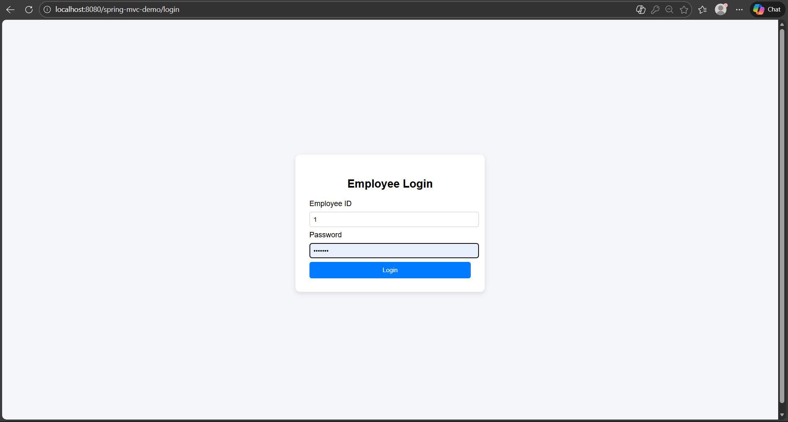
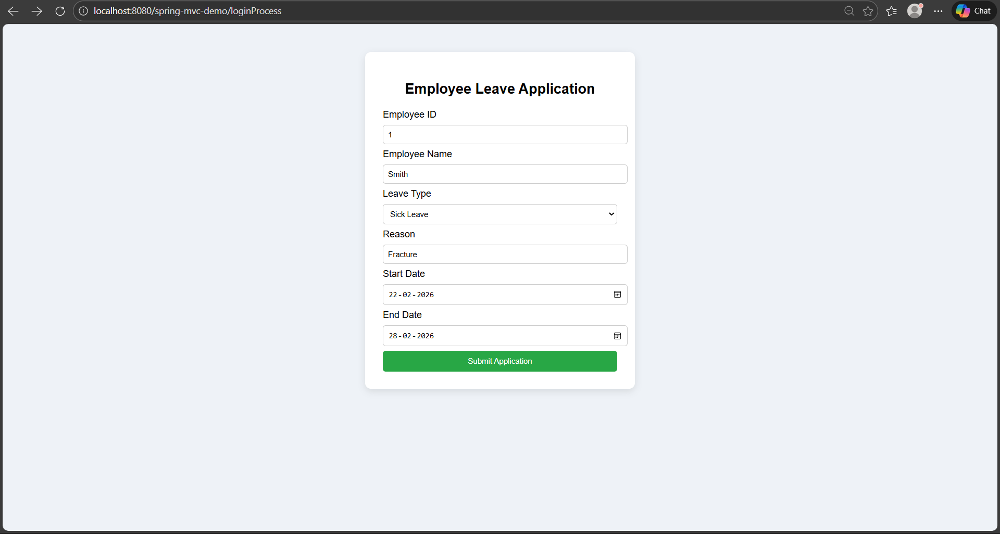
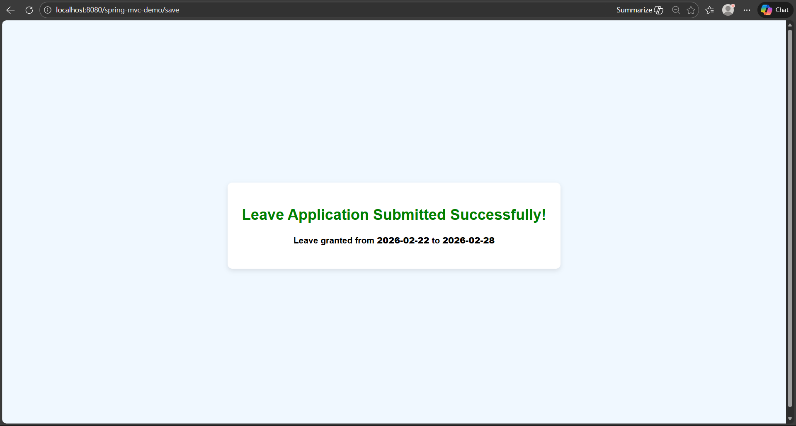

# Spring MVC Employee Leave Management System

A Spring MVC based Employee Leave Management System built using JSP, Maven and Tomcat.

## 🔹 Features
- Employee Login Authentication
- Leave Application Submission
- Leave Details Display
- MVC Architecture Implementation

## 🔹 Technologies Used
- Java
- Spring MVC
- JSP
- Maven
- Apache Tomcat
- HTML/CSS

## 🔹 Project Structure
- Controller Layer
- Model Layer
- View Layer (JSP)
- Maven Configuration

## 🔹 How to Run
1. Import project into Eclipse as Maven Project
2. Configure Apache Tomcat Server
3. Run on Server
4. Access via:
   http://localhost:8080/spring-mvc-employee/

## 📸 Application Screenshots

### 🔐 Login Page

### 📝 Leave Application Form

### ✅ Leave Submitted

## 🔹 Author
Chaitra NT
